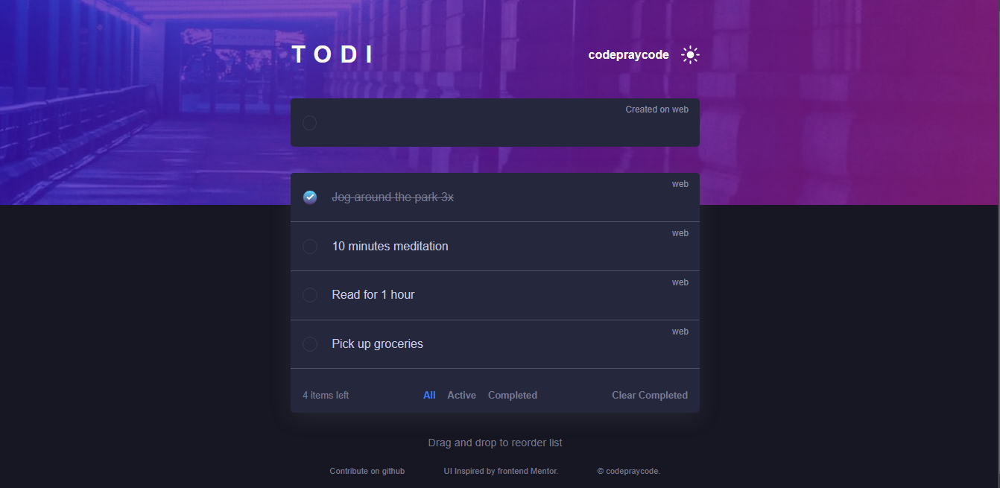

# Todi todo app

A multi-platform Todo app for taking down task, checking them when done or deleting them (maybe when forgetting about them)

# Table of content
- [Overview](#overview)
- [Features](#features)
- [How it works](#how-it-works)
- [Acknowledgement](#acknowledgement)
- [Contribution](#contribution)
- [Author](#author)

<h1></h1>

# Overview

A todo app which is similar to the regular Todo app, except that it supports live synchronization with different platforms on same account. For example, if a user logs in to the Web platform, and at the same time logs in to the mobile platform, any changes made to the todo tasks on any of the platforms is immediately reflected on the other device.

# Features
The features of this app includes:

- Light/dark mode
- Create/check/delete tasks
- Live synchronization between platforms on same account
- Drag and drop

# How it works
The way it works is simple, after login, a bidrectional connection to the server is initialized using socket.io, and changes made to the authenticated user data is automatically communicated to active connections of the authenticated, in real time.

> *Authentication is required to use this app.*

 

# Acknowledgement

Thanks to [frontend mentor](https://www.frontendmentor.io) for inspiring the UI, I took up a challenge, completed it and further developed this.

 

# Contribution

This is open source, and I look forward to extending it to have interesting features. To contribute to this project, first have it running well on your computer, then make your update and pull request and I'll check it out and merge your contribution.

To get it running on your system, do well to do the following:

- clone this repo
- navigate into the clone repo (a directory in your computer) and run `npm install`
- then run `npm start`

You can also fork this repo and make something interesting from it, if you do, do well to [contact me](#author) to see your work.

 

# Author

I am [codepraycode](https://github.com/codepraycode) and here are my contacts:

- Email: [preciousolusola16@gmail.com](preciousolusola16@gmail.com)
- Twitter - [@codepraycode](https://www.twitter.com/codepraycode)
- Instagram - [codepraycode](https://www.instagram.com/codepraycode)
- LinkedIn - [codepraycode](https://www.linkedin.com/in/codepraycode)
